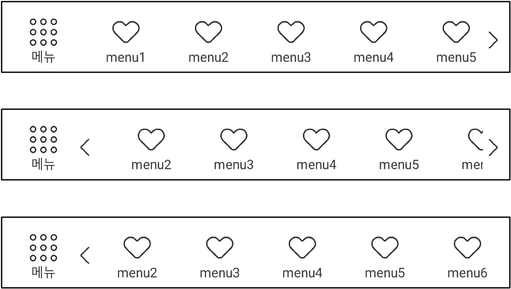

# ScrollBottomNavigation
Android Custom View for Scrollable BottomNavigationView

{: width="200"}

## Setup

### Gradle
[](https://jitpack.io/#DaouMobile/ScrollBottomNavigationView)

```gradle

repositories {
    ...
	maven { url 'https://jitpack.io' }
}

dependencies {
	implementation 'com.github.DaouMobile.ScrollBottomNavigationView:final:1.0.0'
}

```

## How to use

### 1. Set dataBinding
```gradle
dataBinding {
    enabled = true
}
```

### 2. Add ScrollBottomNavigation in XML
```
    <com.daou.lib.ScrollBottomNavigation
        android:id="@+id/bottom_nav"
        android:layout_width="match_parent"
        android:layout_height="60dp"
        android:background="@color/white"
        app:fixed_menu_icon="@drawable/ic_menu_normal"
        app:fixed_menu_icon_active="@drawable/ic_cancel"
        app:fixed_menu_title="@string/label_menu"
        app:layout_constraintBottom_toBottomOf="parent"
        app:maxItemCountInLarge="@{8}"
        app:maxItemCountInSmall="@{6}"
        app:title_text_color="@color/gray_3"
        app:title_text_color_active="@color/gray_3" />
```

### 3. Set Listener
```kotlin
    binding.bottomNav.setOnClickFixedMenu {
        //click event for FixedMenu
        //if you want remove FixedMenu, call bottomNav.removeFixedIcon()
    }
    binding.bottomNav.setOnNavigationItemSelectedListener { tabItem ->
        when (tabItem.type) {
            //type is menu category ex. HOME, NOTIFICATION, ETC
            //move what you want
        }
    }
```

### 4. Set Items
```kotlin
    val menuList = listOf(
        BottomTabItem(
            appName = "menu1",
            text = "menu1",
            badgeContent = null,
            type = HOME,
            iconRes = R.drawable.icon_bottom_menu_heart,
            isClicked = false,
            isDormant = false
        )
    )
    binding.bottomNav.setBottomTabItemList(menuList)
```
